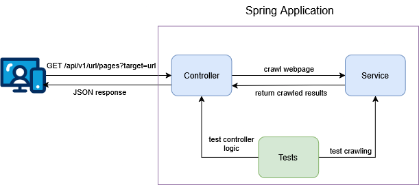

# Web Crawler Repository
## Introduction
The current project is a demonstration for the working of a simple web crawler.
A web crawler is an automated program or bot that systematically searches websites for specific information.
Currently, the crawler has two variants:

* Iterative crawling

* Recursive crawling
## Design
Below is a high-level architecture of the system:

## Tools
* Java 17+

* Spring Boot

* Jsoup (for HTML parsing)

* JUnit and MockMvc

## Performance
In this section we examine the performance differences time-wise between the iterative crawler version
and the recursive one

| Algorithm | Website | Time in seconds |
|-----------|-----|----|
| Iterative |https://crawler-test.com/|----|
| Iterative |https://crawler-test.com/|----|
| Recursive |https://demo.cyotek.com/|----|
| Recursive |https://demo.cyotek.com/|----|


## Possible Improvements

## Running the Project
Below the steps for running the project are shown.
### Building Project
```bash
  git clone https://github.com/KMichaylov/web-crawler-demo.git
```

```bash
  cd web-crawler-demo
```

```bash
  mvn clean install
```
### Run Application

```bash
  mvn spring-boot:run
```